<div align="center">



<code>x3r0day 6.x-hardened</code> · <code>#1 SMP PREEMPT_DYNAMIC</code> · <code>offensive-security/unstable</code> · <code>arch btw</code>

</div>

<br>

<div align="center">

### `./bughunt.sh` &nbsp;·&nbsp; it plays itself, and the bugs still lose



<sub>no, you can't control it. neither can the bugs.</sub>

</div>

---

## `whoami`

<table>
<tr>
<td>

<pre>
                  -`
                 .o+`
                `ooo/
               `+oooo:
              `+oooooo:
              -+oooooo+:
            `/:-:++oooo+:
           `/++++/+++++++:
          `/++++++++++++++:
         `/+++ooooooooooooo/`
        ./ooosssso++osssssso+`
       .oossssso-````/ossssss+`
      -osssssso.      :ssssssso.
     :osssssss/        osssso+++.
    /ossssssss/        +ssssooo/-
  `/ossssso+/:-        -:/+osssso+-
 `+sso+:-`                 `.-/+oso:
`++:.                           `-/+/
.`                                 `/
</pre>

</td>
<td>

<pre>
x3r0day@arch
─────────────────────────────
> host      x3r0day · India
> role      bug hunter, security researcher
> uptime    
> shell     zsh
> editor    nvim
> distro    arch (btw)
> focus     offensive, RE, malware, social-eng
> building  x3r0day framework (pentest toolkit)
> flex      a 32-bit RISC-V CPU. inside roblox.
> also      a (semi) working bash compiler. semi.
> reach     cr4n@duck.com
</pre>

</td>
</tr>
</table>

---

## `cat ~/.loadout`

```ini
[ offense ]    kali · blackarch · parrot · burp · metasploit · wireshark
[ recon   ]    nmap · ffuf · whatever the target deserves
[ code    ]    python · bash · c · go · lua · java · kotlin · js
[ web     ]    node · express · react · mongo
[ systems ]    arch · debian · ubuntu · docker · git
[ daily   ]    nvim · vscode · obsidian · tmux
[ ml      ]    tensorflow, for when a bug needs a brain
```

---

## `cat ~/.trophies`

```ini
[ pyweek 41 ]   won the team category · "the keeper" · python
                team MXRV. you're a lighthouse keeper at the end of the
                world, keeping the light on while the code keeps breaking.

[ hackathon  ]  2nd place · manware's discord hackathon · ran as 'meowha'
                a 32-bit RISC-V CPU and IDE. inside roblox. on purpose.
                asm → parser.lua → bytecode → cpu.lua. and yeah, it runs.
                (won a fucking gaming keyboard for it!)
```

<div align="center">
<sub>
the keeper: <a href="https://github.com/ved-in/The-Keeper">repo</a> · <a href="https://pyweek.org/e/MXRV/">pyweek</a> &nbsp;|&nbsp; rv32im: <a href="https://github.com/X3r0Day/Roblox-RV32IM">repo</a> · <a href="https://x.com/IAmManware/status/2064735031378272599">manware's take</a>
</sub>
<br><br>
<sub>yes, it runs real RISC-V assembly. no, roblox was not built for this.</sub>
</div>

---

<div align="center">

<samp>i break things to understand them, then write down how, so the next person can't.</samp>

<br><br>

<code>connection to x3r0day.sys closed.</code>

<sub>no third-party widgets were used (or harmed) in the making of this profile.</sub>

</div>
